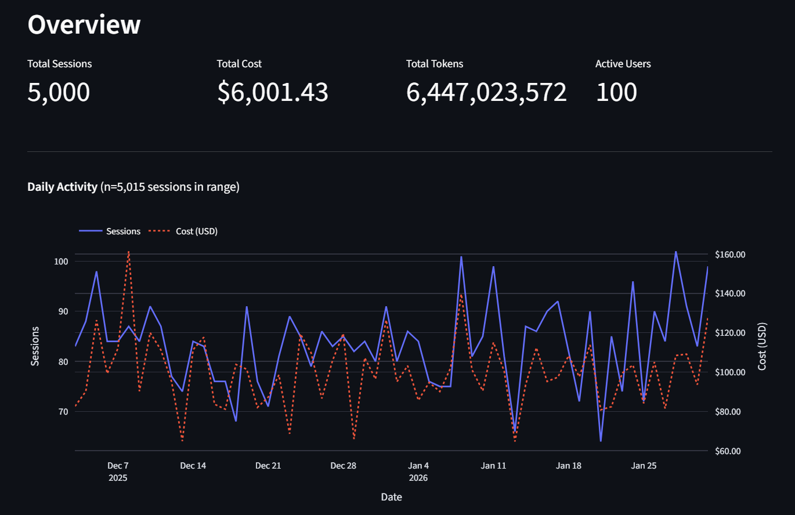
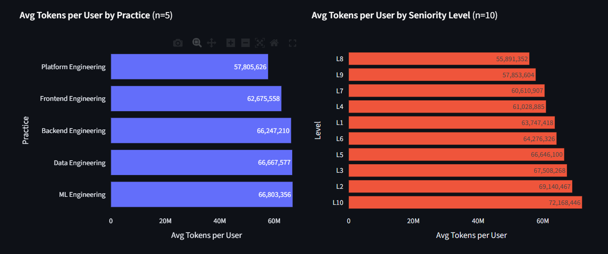
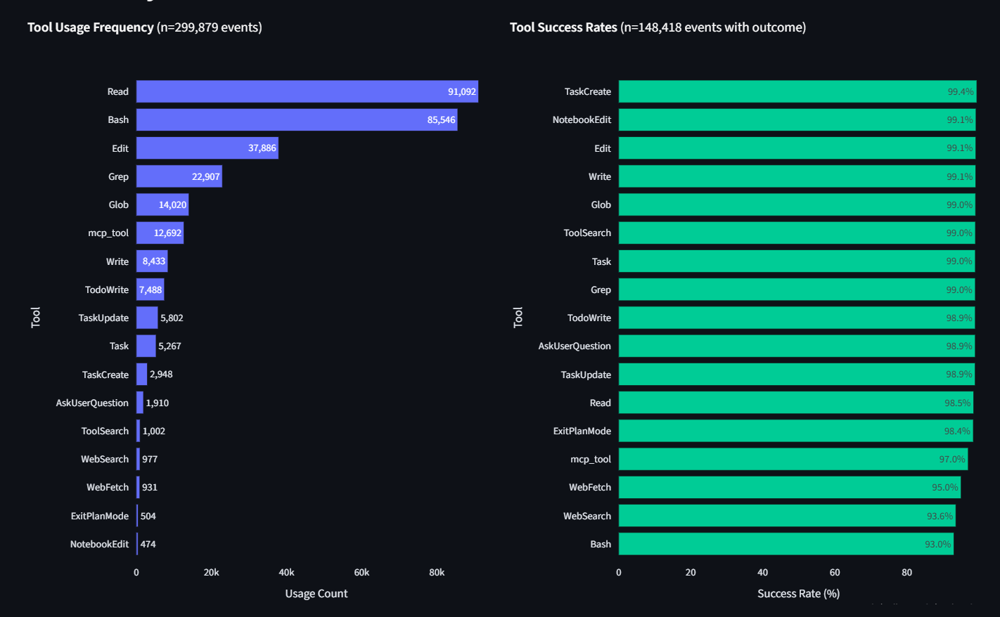
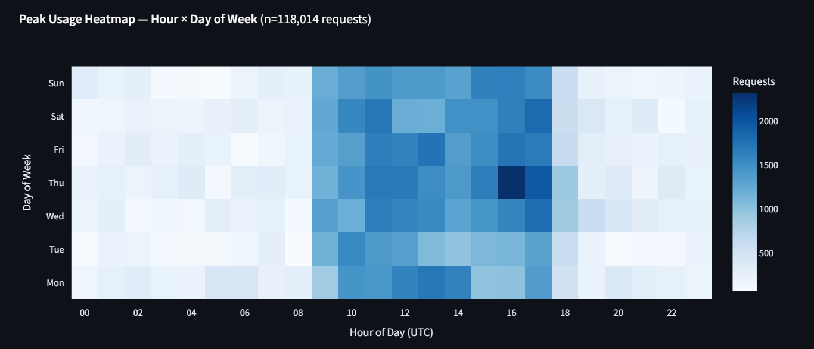
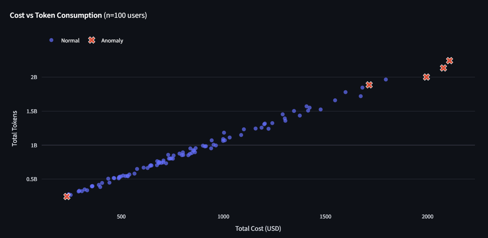
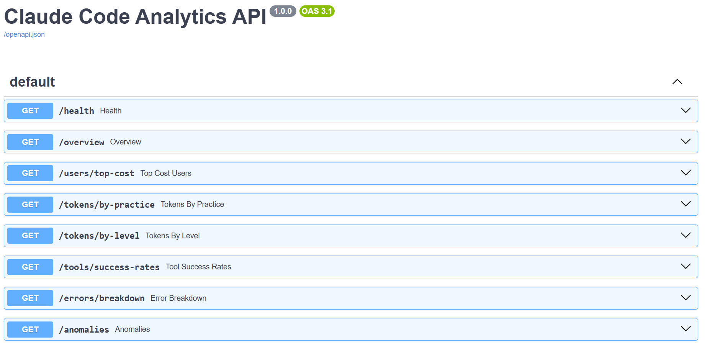

# Claude Code Analytics Platform

> An end-to-end analytics platform that ingests synthetic Claude Code telemetry data, stores it in a structured SQLite database, and surfaces engineering insights through an interactive Streamlit dashboard and REST API.

---

## Architecture

```
┌─────────────────────────────────────────────────────────────────────┐
│                         Data Pipeline                               │
│                                                                     │
│  ┌──────────────┐     ┌──────────────┐     ┌────────────────────┐  │
│  │  Data        │     │  Parser &    │     │  SQLite Database   │  │
│  │  Generator   │────▶│  Validator   │────▶│                    │  │
│  │              │     │              │     │  ┌──────────────┐  │  │
│  │ employees.csv│     │ parser.py    │     │  │  employees   │  │  │
│  │ telemetry    │     │ validator.py │     │  │  sessions    │  │  │
│  │ _logs.jsonl  │     │              │     │  │  api_requests│  │  │
│  └──────────────┘     └──────────────┘     │  │  tool_events │  │  │
│                                            │  │  api_errors  │  │  │
│                                            │  └──────────────┘  │  │
│                                            └────────┬───────────┘  │
└─────────────────────────────────────────────────────┼─────────────┘
                                                       │
                                          ┌────────────▼────────────┐
                                          │    Analytics Layer       │
                                          │    queries.py            │
                                          │    anomaly.py            │
                                          └────────┬────────┬────────┘
                                                   │        │
                              ┌────────────────────▼─┐  ┌───▼──────────────────┐
                              │  Streamlit Dashboard  │  │    FastAPI REST API   │
                              │                       │  │                       │
                              │  · Overview           │  │  GET /sessions        │
                              │  · Token & Cost       │  │  GET /users/top       │
                              │  · Tool Analysis      │  │  GET /tools/usage     │
                              │  · Usage Patterns     │  │  GET /cost/breakdown  │
                              │  · Errors             │  │  GET /anomalies       │
                              │  · Anomalies          │  │  GET /errors          │
                              └───────────────────────┘  └───────────────────────┘
```

---

## Tech Stack

| Layer              | Technology                   | Notes                                      |
|--------------------|------------------------------|--------------------------------------------|
| Language           | Python 3.11+                 | Type hints on all functions                |
| Database           | SQLite via SQLAlchemy        | Lightweight, no infrastructure required    |
| Data Processing    | pandas + DuckDB              | DuckDB for fast JSONL querying             |
| Dashboard          | Streamlit                    | Interactive, stakeholder-friendly UI       |
| Visualization      | Plotly                       | Interactive dark-theme charts              |
| API                | FastAPI + Uvicorn            | Auto-generated Swagger docs at `/docs`     |
| Anomaly Detection  | scikit-learn Isolation Forest| Unsupervised, trained on normal sessions   |
| Data Generation    | Faker                        | Realistic synthetic telemetry              |

---

## Setup

### Prerequisites

- Python 3.11+
- Git

### 1. Clone the repository

```bash
git clone <repository-url>
cd claude_code_analyitics
```

### 2. Create and activate a virtual environment

```bash
python -m venv venv

# Windows
venv\Scripts\activate

# macOS / Linux
source venv/bin/activate
```

### 3. Install dependencies

```bash
pip install -r requirements.txt
```

### 4. Generate synthetic data

```bash
python data/generate_fake_data.py
```

This creates `data/output/telemetry_logs.jsonl` and `data/output/employees.csv`.

### 5. Run the full pipeline (ingest → parse → load)

```bash
python scripts/pipeline.py
```

This parses the JSONL file, validates records, and bulk-inserts everything into the SQLite database.

### 6. Launch the Streamlit dashboard

```bash
streamlit run src/dashboard/app.py
```

Open [http://localhost:8501](http://localhost:8501) in your browser.

### 7. Launch the FastAPI server (optional)

```bash
uvicorn api.main:app --reload
```

Interactive API docs available at [http://localhost:8000/docs](http://localhost:8000/docs).

---

## Project Structure

```
claude_code_analyitics/
├── CLAUDE.md                        # Project guidelines and LLM usage log
├── README.md                        # This file
├── requirements.txt
├── .gitignore
│
├── data/
│   ├── generate_fake_data.py        # Synthetic data generator (Faker-based)
│   └── output/                      # Generated data — gitignored
│       ├── telemetry_logs.jsonl
│       └── employees.csv
│
├── src/
│   ├── ingest/
│   │   ├── parser.py                # JSONL parsing & flattening (triple-nested)
│   │   └── validator.py             # Data quality checks, null handling
│   │
│   ├── db/
│   │   ├── schema.py                # SQLAlchemy table definitions
│   │   └── loader.py                # Bulk insert logic with error handling
│   │
│   ├── analytics/
│   │   ├── queries.py               # 12 analytical SQL/pandas query functions
│   │   └── anomaly.py               # Isolation Forest anomaly detection
│   │
│   └── dashboard/
│       ├── app.py                   # Streamlit entry point, sidebar filters
│       └── components/
│           ├── overview.py          # KPIs: sessions, cost, tokens, users
│           ├── token_usage.py       # Token & cost breakdown by practice/level
│           ├── tool_analysis.py     # Tool usage frequency and success rates
│           ├── cost_analysis.py     # Per-user cost, model distribution, cache
│           └── anomalies.py         # Anomaly detection results and scoring
│
├── api/
│   └── main.py                      # FastAPI app with 8 REST endpoints
│
├── scripts/
│   └── pipeline.py                  # One-shot: generate → ingest → load
│
└── tests/
    ├── test_parser.py
    └── test_queries.py
```

---

## Key Insights Surfaced

### Overview
- **Total sessions, cost, tokens, active users** — top-level KPIs at a glance
- **Daily activity trend** — sessions and cumulative cost over time

### Token & Cost
- **Token usage by practice** — which engineering practice (ML, Backend, Frontend, Platform, Data) consumes the most tokens and incurs the highest API cost
- **Token usage by seniority level** — cost per engineer broken down by L1–L10, normalized to per-session averages for fair comparison
- **Top 10 most expensive users** — ranked by total USD spend across all sessions
- **Model distribution** — share of Haiku vs Sonnet vs Opus requests, with cost implications
- **Cache hit rate** — `cache_read_tokens / total_input_tokens`; a key efficiency metric showing how well prompt caching is working

### Tool Analysis
- **Tool usage frequency** — which tools (Bash, Read, Edit, Glob, Grep, Write) are called most often
- **Tool success rates** — Bash tends to have a higher failure rate than read-only tools; surfaced explicitly
- **Decision breakdown** — proportion of tool calls accepted, rejected by config, or rejected by the user

### Usage Patterns
- **Peak hours heatmap** — hour-of-day × day-of-week activity matrix, revealing when engineers are most active
- **Session length distribution** — turns per session and duration, distinguishing power users from casual users
- **Sessions per user distribution** — identifying power users vs casual users

### Errors
- **Error rate over time** — trend of API errors by day, surfacing reliability issues
- **Error breakdown by type and status code** — which error categories and HTTP status codes occur most frequently
- **Users and models with highest error rates** — pinpoints problematic combinations for investigation

### Anomalies
- **Isolation Forest model** trained exclusively on normal session behavior (token counts, cost, turn counts, duration)
- **Anomaly scores** ranked per user-session, with the most anomalous sessions flagged for review
- **Configurable contamination parameter** — tune the expected outlier rate via `analytics/anomaly.py`

---

## API Endpoints

| Method | Endpoint                | Description                              |
|--------|-------------------------|------------------------------------------|
| GET    | `/sessions`             | List sessions with filters               |
| GET    | `/sessions/{id}`        | Single session detail                    |
| GET    | `/users/top`            | Top users by cost or token usage         |
| GET    | `/tools/usage`          | Tool frequency and success rates         |
| GET    | `/cost/breakdown`       | Cost breakdown by practice and level     |
| GET    | `/anomalies`            | Anomalous sessions from Isolation Forest |
| GET    | `/metrics/overview`     | Aggregate KPIs (cost, tokens, sessions)  |
| GET    | `/errors`               | API error log with status codes          |

Full interactive documentation: `http://localhost:8000/docs`

---

## LLM Usage Log

| # | Tool | Task | Prompt Summary | Validation Method |
|---|------|------------------------------------|--------------------------------------------------------------------------------|--------------------------------------------------------|
| 1 | Claude Code | JSONL parser | "The JSONL is triple-nested — each line is a batch, inside are logEvents, and each message is a JSON string that needs parsing again. Help me write a parser that handles this cleanly" | Manually inspected extracted records against raw JSONL |
| 2 | Claude Code | SQLAlchemy schema | "Define SQLAlchemy ORM models for sessions, api_requests, tool_events, api_errors based on this schema" | Ran schema creation and verified tables via SQLite CLI |
| 3 | Claude Code | Cache hit rate query | "How do I calculate cache hit rate per practice? It should be cache_read_tokens divided by total input tokens, normalized per user not per request" | Compared results to manual aggregation on sample data |
| 4 | Claude Code | Anomaly detection | "I want to flag users with unusual behavior using Isolation Forest. Features should be cost, tokens, error rate, session count. Help me set this up and return anomaly scores" | Verified flagged users matched visually obvious outliers on scatter plot |
| 5 | Claude Code | FastAPI endpoints | "Create FastAPI endpoints for overview stats, token usage, tool success rates, errors and anomalies. Each should return JSON and have proper error handling" | Tested each endpoint manually via Swagger UI at /docs |
| 6 | Claude Code | Streamlit dashboard | "Set up a multi-page Streamlit app with a sidebar for date range, practice and level filters. Each page should be a separate component file" | Ran dashboard locally and verified filters affect all charts |
| 7 | Claude Code | Peak hours heatmap | "Create a Plotly heatmap showing when developers use Claude Code most — rows are hours of day, columns are days of week, values are session counts" | Cross-checked heatmap values against raw SQL GROUP BY query |
| 8 | Claude Code | Avg tokens per user | "The tokens by practice chart is misleading because ML has more engineers. Change it to show average tokens per user instead of totals" | Verified the per-user averages made cross-practice comparison fair |

---

## Screenshots

### Dashboard — Overview Page


### Dashboard — Token & Cost Analysis


### Dashboard — Tool Analysis


### Dashboard — Usage Patterns


### Dashboard — Anomalies


### API — Swagger UI


---

## Running Tests

```bash
pytest tests/ -v
```

---

## Notes

- Generated data files (`data/output/`) are gitignored and must be regenerated locally.
- The SQLite database file is also gitignored.
- All chart templates use `plotly_dark` for a consistent dark-theme look.
- The Isolation Forest model is re-trained on each pipeline run — no model persistence is needed given the synthetic dataset size.
